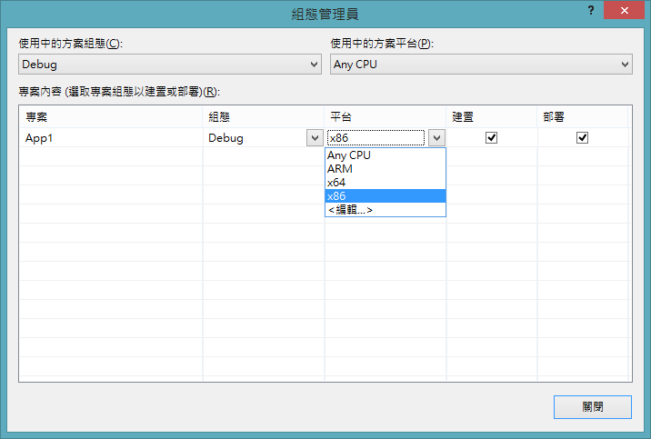

# moedict-rt

moedict-rt 是根據「[還文於民](http://3du.tw)」計劃，設計了為 Windows Store Apps 能用的教育部國語辭典 WinRT Component，讓開發 Windows 市集應用程式的開發人員，能夠以簡易的方式查詢教育部國語辭典的內容。

## 建置環境準備

本專案使用 Visual Studio 2012 所建置，若無 Visual Studio 2012 各版本授權的開發人員，可以免費下載 [Visual Studio Express 2012 for Windows 8](http://www.microsoft.com/visualstudio/cht/downloads#d-2012-express) 來修改及建置。

此外，本專案使用由 SQLite 官方所開發的 [SQLite for Windows Runtime](http://visualstudiogallery.msdn.microsoft.com/23f6c55a-4909-4b1f-80b1-25792b11639e)，若要成功建置專案，必須先安裝這個套件才能完成。安裝方式：

  1. 在 Visual Studio 中的選單選擇「工具 (TOOLS)」 -> 「擴充功能和更新... (Extensions and Updates...)」。
 
  2. 左側選單中選擇 *線上 (Online)* 並且搜尋 _SQLite for Windows Runtime_ ，然後下載安裝：
     

  3. 重新啟動 Visual Studio 就完成了。

## 使用此元件前置作業

不論您是使用 Visual C++、Visual Basic、Visual C# 還是 JavaScript 來開發 Windows 市集應用程式，都必須準備在開始寫作程式前做好下列準備：

  1. 參考上述的方式安裝 _SQLite for Windows Runtime_，這樣才會在建立 app 套件時加入 *sqlite3.dll* 檔案

  2. 下載最新的 moedict，目前是採用 kcwu 所整理的版本: [development.sqlite3.bz2](http://kcwu.csie.org/~kcwu/tmp/moedict/development.sqlite3.bz2)，將下載後的檔案解壓縮後，放在專案目錄中並且將其封裝方式設定為「內容 (Content)」以及「永遠複製 (Copy always)」，如此才會正確地放置在 App 套件中。
     

  3. 將 MoeDictRT.winmd 及 MoeDictRT.dll 置放於專案目錄，並且與 _SQLite for Windows Runtime_ 一併加入專案參考 (References...)
     

  4. 由於這個元件是使用 C++/CX 所開發，所以 app 套件無法以 _Any CPU_ 的組態編譯，必須根據使用的 dll 版本來調整組態設定，欲上架至 Windows Store 時，可以建立三個 app 套件 (x86, x64, ARM) 然後上架。
     


## 程式碼範例

  * 使用 C# 查詢單字部首

    ```C#
    // 建立 MoeDict 元件實體
    var mdCom = new MoeDictRT.MoeDict("/path/to/moedict.sqlite3");
    // 查詢部首
    var result = await mdCom.LookupWordAsync("萌");
    if (result.Error == "")
    {
      // result.Radical 為「艸」
    }
    ```

  * 使用 JavaScript 查詢單字部首

    ```JavaScript
    // 建立 MoeDict 元件實體
    var mdCom = new MoeDictRT.MoeDict("/path/to/moedict.sqlite3");
    // 查詢部首
    mdCom.lookupWordAsync("萌").then(function(response) {
      if (response.Error == "") {
        // response.Radical 為 "艸"
      }
    });
    ```
